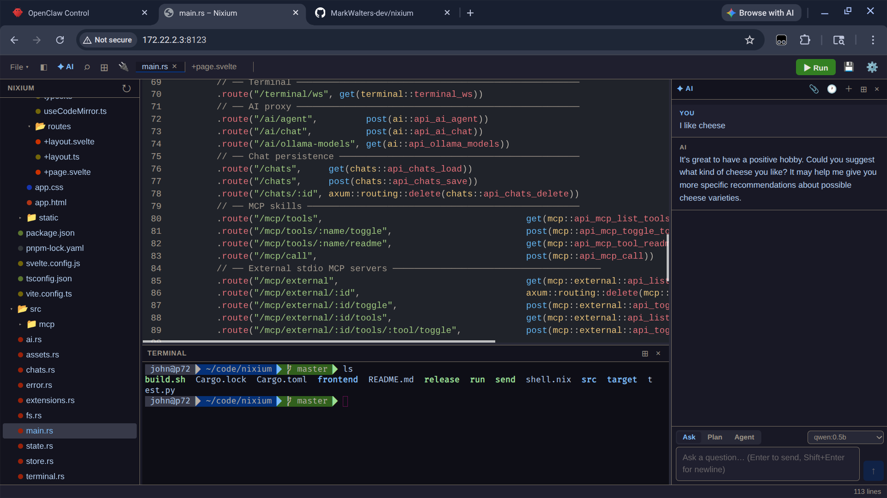

# Nixium

> 99% vibe coded

Nixium is a local, privacy-first code editor and AI assistant that brings the power of modern AI models and tool-augmented reasoning to your desktop. It is designed for developers who want a fast, extensible, and hackable environment for coding, chatting with AI, and running custom tools—all without sending your code to the cloud.

---

## Features

- **Local-first:** All code and AI interactions run on your machine. No code leaves your device unless you explicitly configure it.
- **AI Chat Assistant:** Chat with advanced AI models (OpenAI, Ollama, Anthropic, and more) directly in your editor. Supports code generation, refactoring, and natural language queries.
- **Tool-Augmented Reasoning (MCP):** Integrate and invoke custom tools (Model Context Protocol) from chat, including shell commands, code search, weather APIs, and more.
- **Modern Code Editor:** Syntax highlighting, file browsing, and terminal access in a single interface.
- **Extensible:** Add new MCP tools, AI providers, or UI components with minimal effort.
- **Offline Support:** Use local models (e.g., Ollama) and tools without an internet connection.
- **Keyboard-Driven:** Fast navigation and editing with keyboard shortcuts.

---

## Quick Start

### Prerequisites
- [Rust](https://www.rust-lang.org/tools/install)
- [Node.js](https://nodejs.org/) & [pnpm](https://pnpm.io/)
- [Nix](https://nixos.org/download.html) (optional, for reproducible builds)
- (Optional) [Ollama](https://ollama.com/) for local LLMs

### Build & Run

```sh
# Clone the repo
$ git clone https://github.com/yourusername/nixium.git
$ cd nixium

# (Optional) Enter Nix shell for reproducible environment
$ nix-shell

# Build the frontend
$ cd frontend
$ pnpm install
$ pnpm run build
$ cd ..

# Build and run the backend
$ cargo build --release
$ ./target/release/nixium
```

The app will start a local web server. Open your browser to [http://localhost:3000](http://localhost:3000) to use Nixium.

---

## Architecture

- **Frontend:** SvelteKit (TypeScript, Svelte, Vite)
- **Backend:** Rust (Axum web server, MCP tool registry, AI provider integration)
- **MCP (Model Context Protocol):** Unified interface for tool-augmented AI reasoning
- **Providers:** OpenAI, Ollama, Anthropic, and custom LLMs

---

## Adding Custom MCP Tools

1. Edit `src/main.rs` to register a new tool in the MCP registry.
2. Define the tool's description, input/output schema, and handler function.
3. Rebuild the backend (`cargo build`).
4. The tool will appear in the sidebar and can be invoked from chat.

---

## Security & Privacy

- All code and chat data remain local by default.
- No telemetry or analytics.
- You control which AI providers and tools are enabled.

---

## Contributing

Contributions are welcome! Please open issues or pull requests for bug fixes, features, or documentation improvements.

---

## License

MIT License. See [LICENSE](LICENSE) for details.

---

## Acknowledgements

- [SvelteKit](https://kit.svelte.dev/)
- [Rust](https://www.rust-lang.org/)
- [Ollama](https://ollama.com/)
- [OpenAI](https://openai.com/)
- [Anthropic](https://www.anthropic.com/)

---

## Screenshots



---

## FAQ

**Q: Does Nixium require an internet connection?**
A: No, you can use local models and tools. Some AI providers require internet access.

**Q: How do I add a new tool?**
A: See the "Adding Custom MCP Tools" section above.

**Q: Is my code sent to the cloud?**
A: No, unless you explicitly use a cloud-based AI provider.

---

For more information, see the [docs/](docs/) directory or open an issue.
